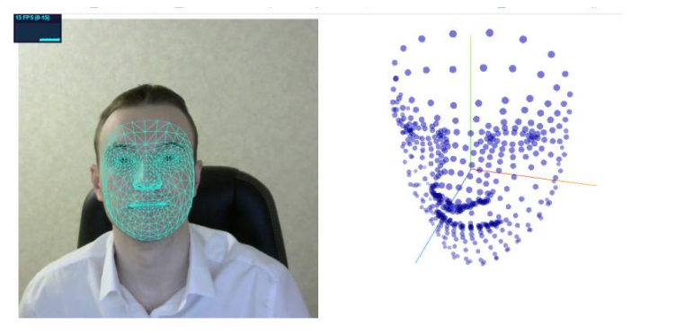

# magic-quest
Основная часть проекта представляет собой веб-квест, как модуль
веб-приложения, являющийся компонентом реализации
внедрения интерактивности в образовательный процесс.

Реализован в виде текстового квеста,
имеющего последовательность шагов, а также вариативные пути развития и
прохождения, определяемые администратором.

Написан в 2020 году в рамках дипломной работы и ознакомления с фреймворком Laravel.
Перенесён, так как являлся частью общего проекта.

  

Административная часть:

Пользовательская часть:

В проект внедрены <a href="https://google.github.io/mediapipe/solutions/face_mesh.html">MediaPipe Face Mesh</a> и <a href="https://google.github.io/mediapipe/solutions/hands.html">MediaPipe
Hands</a> - решения от Google, позволяющие распознавать и отслеживать лицо и руки. 
Применение выражено в виде прокрутки контента страницы с помощью наклона головы, 
а также управление курсором посредством жестов.

